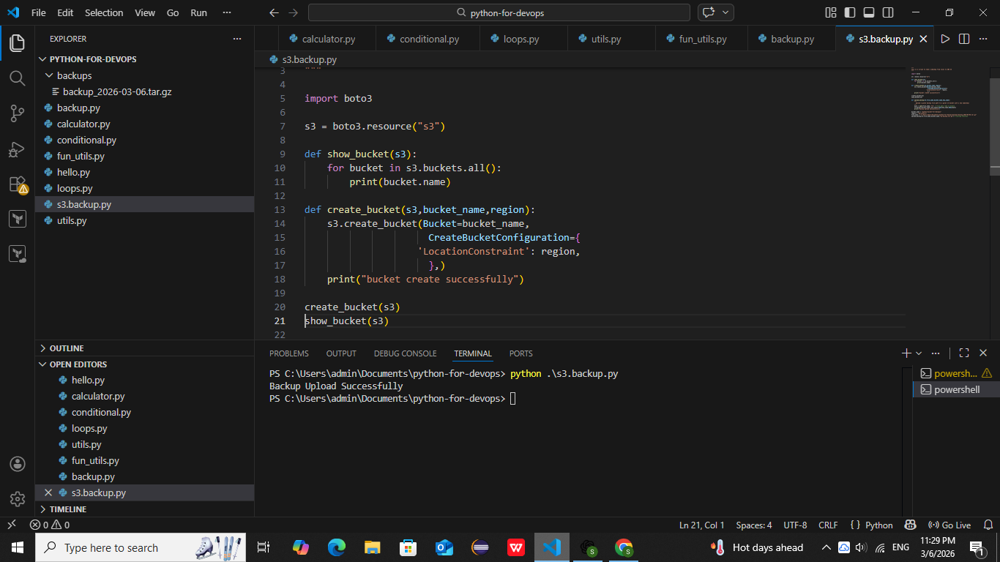
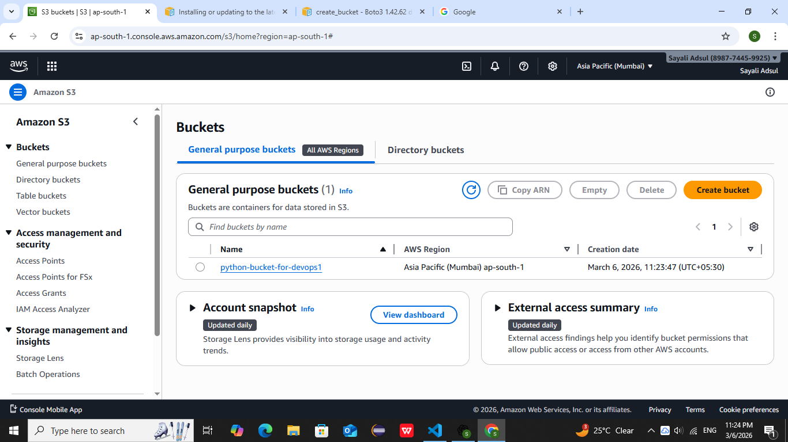
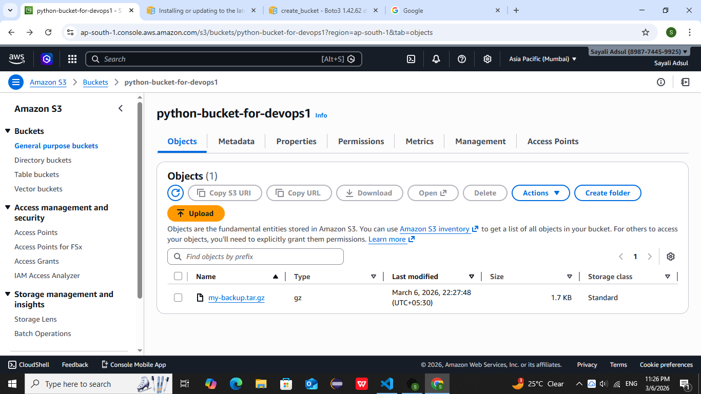

# 🚀 Python AWS S3 Backup Automation 

This project is a DevOps automation script that uploads a local backup file to AWS S3 using Python.

---

## 📌 Features

- Create S3 bucket
- List S3 buckets
- Upload backup file to S3
- Automate backup process

---

## 🛠 Technologies

- Python
- AWS S3
- Boto3
- PowerShell
- Git

---

python-s3-backup
│
├── s3.backup.py
├── backups
├── screenshots
└── README.md 

---

## ⚙️ Setup

Install boto3:
pip install boto3

Configure AWS:
aws configure

---

## ▶️ Commands Used
'''cd Documents/python-for-devops
pwd
cd backups
cd ..
python s3.backup.py'''

---

## 📷 Screenshots

### Script Execution

### S3 Bucket

### Uploaded Backup

---

## 📌 DevOps Concepts

- AWS S3
- Automation
- Backup management
- Python scripting

---

## 👩‍💻 Author

Sayali Adsul  
DevOps & AWS Learner

## 📁 Project Structure

